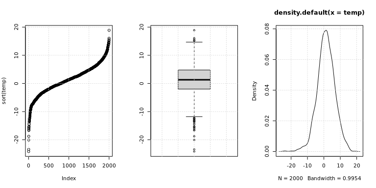
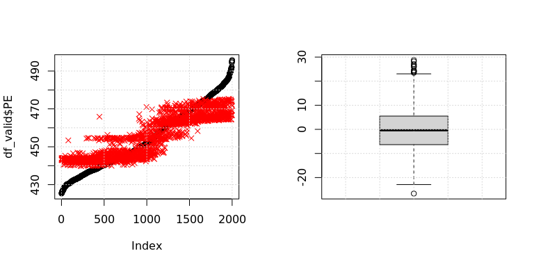
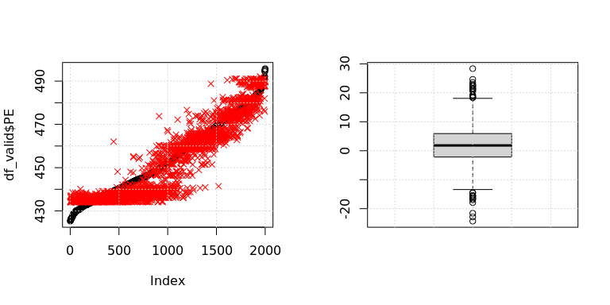
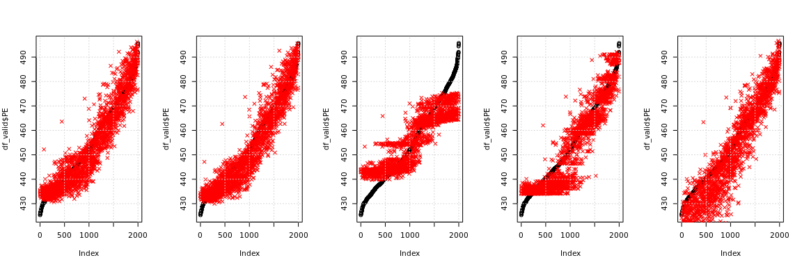
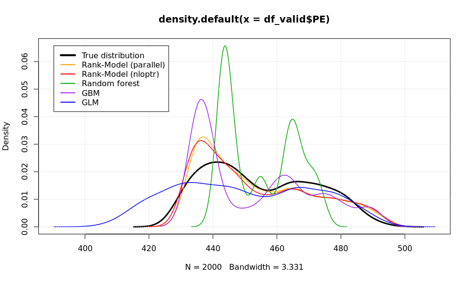

# Rank-model Tests

In this notebook, we test the rank model using very low counts of
labeled observations against other, state-of-the-art models, such as
Random forest, GBM, and Generalized Linear Models. We deliberately pick
an example where the Rank-model is best. For a proper validation, we
would need to compute a grid of various settings and repeat each
computation numerous times with different seeds. This, however, is not
done here.

``` r
source(file = "../R/helpers.R")
source(file = "../R/rank-model.R")
```

``` r
library(readxl)
Folds5x2_pp <- read_excel("../data/Folds5x2_pp.xlsx")

set.seed(1336)
split_indexes <- caret::createDataPartition(y = Folds5x2_pp$PE, times = 1, p = 0.001, list = FALSE)

df_train <- as.data.frame(Folds5x2_pp[split_indexes,])
df_valid <- as.data.frame(Folds5x2_pp[-split_indexes,][1:2000,])
df_valid <- df_valid[order(df_valid$PE),]
```

``` r
model <- create_model(df_train = df_train, x_cols = colnames(df_train[1:4]), y_col = colnames(df_train)[5], cdf_type = "gauss")
```

``` r
# Test:
set.seed(1337)
model(x=runif(14), df_valid[1:10,])
```

    ##      415      967     1682     1835      338     1164     1487     1032 
    ## 477.2701 474.9932 476.0936 475.6772 478.6579 476.7700 479.0494 477.4851 
    ##      402     1390 
    ## 477.1259 478.7265

``` r
# Like I wrote before, the current approach to regularization is arbitrary
# and needs to be thought through well. For example, if, by default, we
# initialize biases to 0 and weights to 1, then a regularizer could measure
# the distance from these "ideal" values (ideal here means that if the model
# would fit the data already perfectly, no adjustments to these would be re-
# quired).
model_regularizer <- function(x) 1e-1 * log(1 + mean(x^2))
```

``` r
result_parallel <- loadResultsOrCompute(file = "../results/rank_pred_parallel.rds", computeExpr = {
    cl <- parallel::makePSOCKcluster(min(12, parallel::detectCores()))
    
    doWithParallelClusterExplicit(cl = cl, stopCl = TRUE, expr = {
        parallel::clusterExport(cl, varlist = list("sigmoid", "swish", "smooth_min", "smooth_max", "hard_sigmoid", "model", "model_regularizer", "model_loss", "model_loss_ws", "wasserstein_distance", "model_loss_kla", "kl_div_approx", "df_train"))

        set.seed(1)
        res <- optimParallel::optimParallel(
            par = runif(14),
            lower = rep(-1e3, 14),
            upper = rep( 1e3, 14),
            # Note how we also added the regularization here:
            fn = function(x) model_regularizer(x) + model_loss(model = model, x = x, df = df_train, y_col = "PE"),
            parallel = list(cl = cl, forward = FALSE, loginfo = TRUE),
            control = list(maxit = 500, factr = 1e-3)) # This is for L-BFGS-B, the only supported minimizer.
        
        library(foreach)
        list(
            "res" = res,
            "train_hist" = res$loginfo[,"fn"],
            "loss_train" = model_loss(model = model, x = res$par, df = df_train, y_col = "PE"),
            "loss_valid" = model_loss(model = model, x = res$par, df = df_valid, y_col = "PE"),
            "pred" = foreach::foreach(
                rn = rownames(df_valid),
                .inorder = TRUE,
                .combine = c
            ) %dopar% {
                model(x = res$par, df = df_valid[rn,])
            })
    })
})
```

``` r
`names<-`(
    x = c(result_parallel$res$value, result_parallel$loss_train, result_parallel$loss_valid),
    value = c("objective", "loss_train", "loss_valid"))
```

    ##  objective loss_train loss_valid 
    ##   2.547292   2.442457   5.587985

``` r
par(mfrow = c(1,2))
plot(log(result_parallel$train_hist), type="l")
grid()

plot(df_valid$PE, pch=1)
points(result_parallel$pred, col="red", pch = 4)
grid()
```

<!-- -->

Let’s also try nloptr:

``` r
result_nloptr <- loadResultsOrCompute(file = "../results/rank_pred_nloptr.rds", computeExpr = {
    set.seed(1)

    train_hist <- c()
    tempf <- function(x, grad = TRUE) {
        o <- model_loss(model = model, x = x, df = df_train, y_col = "PE")
        # I added some L2 regularization here. We get a slightly worse
        # result, but the weights are much less extreme. However, this
        # was just a test and if we want to introduce regularization
        # properly, this needs to be done carefully.
        o <- o + model_regularizer(x)
        if (!grad) {
            train_hist <<- c(train_hist, o)
        }
        o
    }

    res <- nloptr::nloptr(
      x0 = runif(14),
      eval_f = function(x) tempf(x = x, grad = FALSE),
      eval_grad_f = function(x) pracma::grad(f = tempf, x0 = x),
      lb = rep(-1e3, 14),
      ub = rep( 1e3, 14),
      opts = list(algorithm = "NLOPT_LD_TNEWTON", xtol_rel=1e-3, maxeval=500))

    list(
        "res" = res,
        "train_hist" = train_hist,
        "loss_train" = model_loss(model = model, x = res$solution, df = df_train, y_col = "PE"),
        "loss_valid" = model_loss(model = model, x = res$solution, df = df_valid, y_col = "PE"),
        "pred" = model(x = res$solution, df = df_valid))
})
```

``` r
`names<-`(
    x = c(result_nloptr$res$objective, result_nloptr$loss_train, result_nloptr$loss_valid),
    value = c("objective", "loss_train", "loss_valid"))
```

    ##  objective loss_train loss_valid 
    ##   2.612919   2.523960   5.382316

``` r
par(mfrow = c(1,2))
plot(log(result_nloptr$train_hist), type="l")
grid()

plot(df_valid$PE, pch=1)
points(result_nloptr$pred, col="red", pch = 4)
grid()
```

<!-- -->

``` r
par(mfrow = c(1,3))
temp <- df_valid$PE - result_nloptr$pred
plot(sort(temp))
grid()
boxplot(abs(temp))
grid()
plot(density(temp))
grid()
```

<!-- -->

# Testing of other Models

Here, we test other state-of-the-art models on the same data. In
particular, we test a Random forest, a Gradient Boosting Machine, and a
Generalized Linear Model.

``` r
set.seed(1338)
temp <- randomForest::randomForest(PE ~., df_train)
pred_rf <- stats::predict(temp, df_valid)

`names<-`(
    x = c(
        Metrics::rmse(actual = as.numeric(df_train$PE), predicted = stats::predict(temp, df_train)),
        Metrics::rmse(actual = as.numeric(df_valid$PE), predicted = pred_rf)),
    value = c("loss_train", "loss_valid"))
```

    ## loss_train loss_valid 
    ##   6.083024   8.471612

``` r
par(mfrow = c(1,2))
plot(df_valid$PE, pch=1)
points(pred_rf, col="red", pch=4)
grid()

temp <- df_valid$PE - pred_rf
boxplot(abs(temp))
grid()
```

<!-- -->

``` r
set.seed(1338)
temp <- gbm::gbm(PE ~., data = df_train, n.minobsinnode = 1, distribution = "gaussian", verbose = FALSE)

pred_gbm <- suppressMessages({
    stats::predict(temp, df_valid)
})

`names<-`(
    x = c(
        suppressMessages({
            Metrics::rmse(actual = as.numeric(df_train$PE), predicted = stats::predict(temp, df_train))
        }),
        Metrics::rmse(actual = as.numeric(df_valid$PE), predicted = pred_gbm)),
    value = c("loss_train", "loss_valid"))
```

    ## loss_train loss_valid 
    ##  0.7326914  6.4772115

``` r
par(mfrow = c(1,2))
plot(df_valid$PE, pch=1)
points(pred_gbm, col="red", pch=4)
grid()

temp <- df_valid$PE - pred_gbm
boxplot(abs(temp))
grid()
```

<!-- -->

``` r
set.seed(1338)
temp <- stats::glm(PE ~., data = df_train, family = gaussian)
pred_glm <- stats::predict(temp, df_valid)

`names<-`(
    x = c(
        Metrics::rmse(actual = as.numeric(df_train$PE), predicted = stats::predict(temp, df_train)),
        Metrics::rmse(actual = as.numeric(df_valid$PE), predicted = pred_glm)),
    value = c("loss_train", "loss_valid"))
```

    ## loss_train loss_valid 
    ##   3.122480   9.135451

``` r
par(mfrow = c(1,2))
plot(df_valid$PE, pch=1)
points(pred_glm, col="red", pch=4)
grid()

temp <- df_valid$PE - pred_glm
boxplot(abs(temp))
grid()
```

<!-- -->

# Comparison of Rank-model to Others

Let’s compare the models’ performances.

``` r
`names<-`(
    x = c(nrow(df_train), nrow(df_valid)),
    value = c("Num_obs", "num_valid"))
```

    ##   Num_obs num_valid 
    ##        12      2000

In the following table, “se” means squared error. All results are
computed using the validation data.

``` r
bp_parallel <- sqrt((df_valid$PE - result_parallel$pred)^2)
bp_nloptr <- sqrt((df_valid$PE - result_nloptr$pred)^2)
bp_rf <- sqrt((df_valid$PE - pred_rf)^2)
bp_gbm <- sqrt((df_valid$PE - pred_gbm)^2)
bp_glm <- sqrt((df_valid$PE - pred_glm)^2)

rq <- function(x) round(x = quantile(x, c(0, .25, .5, .75, 1)), digits = 5)

`rownames<-`(
    x = data.frame(
        rank_parallel = c(result_parallel$loss_valid, mean(bp_parallel), rq(bp_parallel)),
        rank_nloptr = c(result_nloptr$loss_valid, mean(bp_nloptr), rq(bp_nloptr)),
        rf = c(Metrics::rmse(actual = df_valid$PE, predicted = pred_rf), mean(bp_rf), rq(bp_rf)),
        gbm = c(Metrics::rmse(actual = df_valid$PE, predicted = pred_gbm), mean(bp_gbm), rq(bp_gbm)),
        glm = c(Metrics::rmse(actual = df_valid$PE, predicted = pred_glm), mean(bp_glm), rq(bp_glm))),
    value = c("valid_rmse", "valid_se_mean", "valid_se_quant_0", "valid_se_quant_0.25", "valid_se_quant_0.5", "valid_se_quant_0.75", "valid_rmse_quant_1")
)
```

|                     | rank_parallel | rank_nloptr |        rf |       gbm |       glm |
|:--------------------|--------------:|------------:|----------:|----------:|----------:|
| valid_rmse          |      5.587985 |    5.382316 |  8.471612 |  6.477212 |  9.135451 |
| valid_se_mean       |      4.424365 |    4.205034 |  6.850995 |  5.062003 |  6.889872 |
| valid_se_quant_0    |      0.001410 |    0.000790 |  0.005190 |  0.000860 |  0.000580 |
| valid_se_quant_0.25 |      1.717610 |    1.589010 |  3.006480 |  2.006370 |  2.226710 |
| valid_se_quant_0.5  |      3.647350 |    3.402140 |  5.994290 |  4.119950 |  5.167980 |
| valid_se_quant_0.75 |      6.404760 |    6.017500 |  9.692720 |  7.142940 |  9.994510 |
| valid_rmse_quant_1  |     24.349800 |   24.187040 | 28.753400 | 28.350380 | 34.371660 |

``` r
par(mfrow = c(1,5))
ylim <- c(
    min(c(bp_parallel, bp_nloptr, bp_rf, bp_gbm, bp_glm)),
    max(c(bp_parallel, bp_nloptr, bp_rf, bp_gbm, bp_glm)))

boxplot(bp_parallel, ylim = ylim, main = "rank_parallel")
boxplot(bp_nloptr, ylim = ylim, main = "rank_nloptr")
boxplot(bp_rf, ylim = ylim, main = "rf")
boxplot(bp_gbm, ylim = ylim, main = "gbm")
boxplot(bp_glm, ylim = ylim, main = "glm")
```

<!-- -->

``` r
par(mfrow = c(1,5))

plot(df_valid$PE, pch=1)
points(result_parallel$pred, col="red", pch = 4)
grid()
plot(df_valid$PE, pch=1)
points(result_nloptr$pred, col="red", pch = 4)
grid()

plot(df_valid$PE, pch=1)
points(pred_rf, col="red", pch=4)
grid()

plot(df_valid$PE, pch=1)
points(pred_gbm, col="red", pch=4)
grid()

plot(df_valid$PE, pch=1)
points(pred_glm, col="red", pch=4)
grid()
```

<!-- -->

In the following plot, we show the distribution of the true numeric
labels, as well as the distribution of the predicted labels from all
models. The Rank-Models predict labels that result in a distribution
closest to the true distribution.

``` r
dens_valid <- density(df_valid$PE)
dens_parallel <- density(result_parallel$pred)
dens_nloptr <- density(result_nloptr$pred)
dens_rf <- density(pred_rf)
dens_gbm <- density(pred_gbm)
dens_glm <- density(pred_glm)

xlim <- range(c(dens_valid$x, dens_parallel$x, dens_nloptr$x, dens_rf$x, dens_gbm$x, dens_glm$x))
ylim <- range(c(dens_valid$y, dens_parallel$y, dens_nloptr$y, dens_rf$y, dens_gbm$y, dens_glm$y))
plot(dens_valid, xlim = xlim, ylim = ylim, lwd = 3)
lines(dens_parallel, col = "orange", lwd = 1.5)
lines(dens_nloptr, col = "red", lwd = 1.5)
lines(dens_rf, col = "#00aa00", lwd = 1.5)
lines(dens_gbm, col = "purple", lwd = 1.5)
lines(dens_glm, col = "blue", lwd = 1.5)
grid()
legend(x = xlim[1], y = ylim[2], legend = c("True distribution", "Rank-Model (parallel)", "Rank-Model (nloptr)", "Random forest", "GBM", "GLM"), col = c("#000000", "orange", "red", "#00aa00", "purple", "blue"), lwd = c(4, rep(2,5)))
```

<!-- -->
